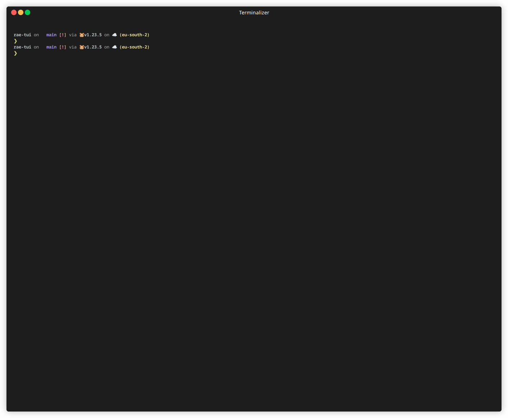

# RAE-TUI

A terminal-based Spanish dictionary client for the Royal Spanish Academy (Real Academia Española - RAE).



## Features

- Look up Spanish words directly from your terminal
- View detailed definitions and meanings
- Interactive TUI (Terminal User Interface) with keyboard navigation
- Display verb conjugations in all tenses
- Non-interactive CLI mode for quick lookups
- No API key required

## Installation

### From Source

```bash
go install github.com/rae-api-com/rae-tui@latest
```

### Binary Releases

Download the appropriate binary for your platform from the [Releases](https://github.com/rae-api-com/rae-tui/releases) page.

## Usage

### Interactive TUI Mode

Launch the interactive TUI:

```bash
rae-tui
# or
rae-tui tui
```

With a specific word:

```bash
rae-tui tui palabra
```

### CLI Mode

Lookup a word directly:

```bash
rae palabra
```

### Keyboard Shortcuts (TUI Mode)

- `↑`/`k`: Move selection up
- `↓`/`j`: Move selection down
- `n`: Search for a new word
- `q`/`ESC`: Exit or go back
- `ENTER`: Select

## License

MIT License

## Acknowledgements

- [go-rae](https://github.com/rae-api-com/go-rae) - Go client for the RAE API
- [tview](https://github.com/rivo/tview) - Terminal UI library
- [Terminalizer](https://terminalizer.com/) - Used for creating demo GIFs
